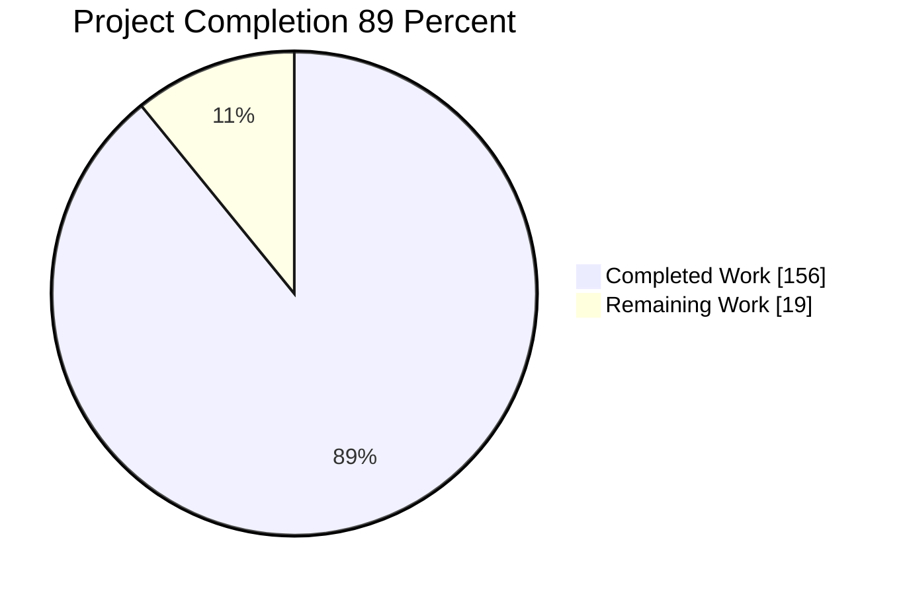
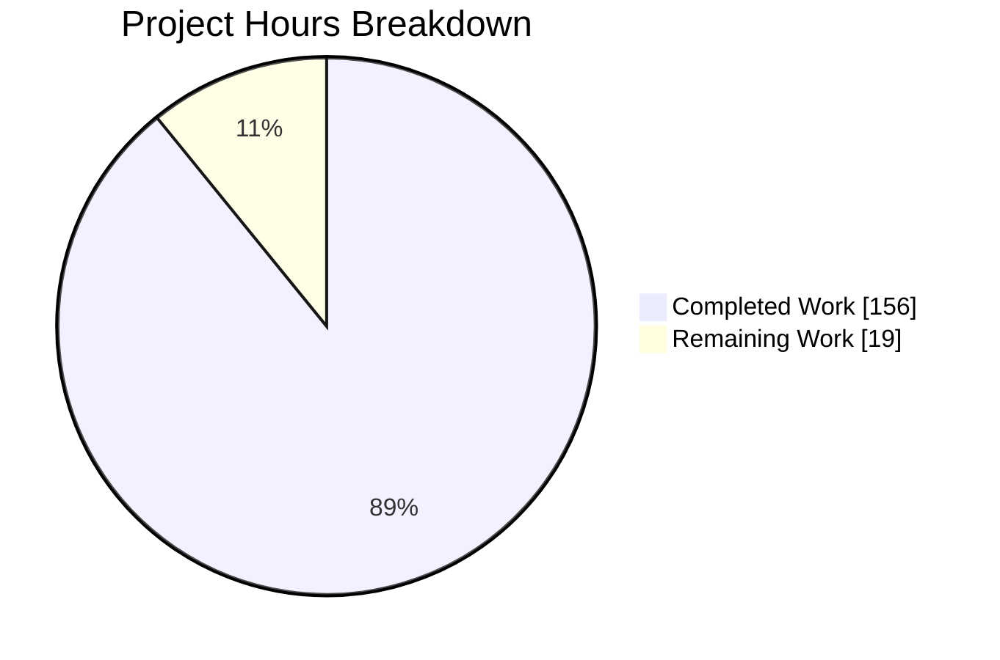
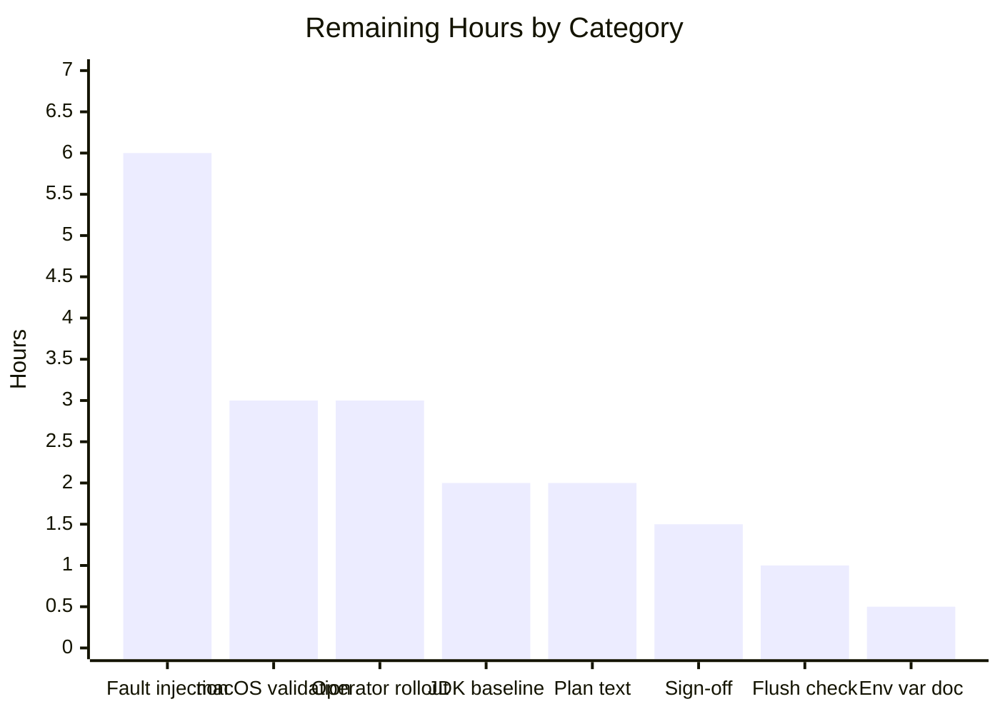
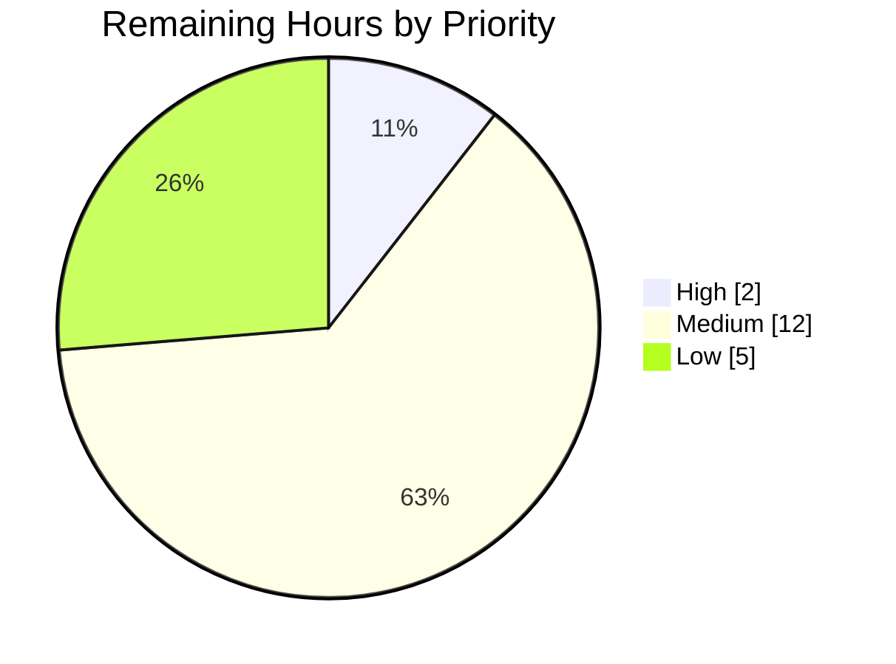

# 1. Executive Summary

## 1.1 Project Overview

The repository's single COBOL program — a 515-line interactive text file editor — is now a Java 17
codebase. Four classes under `src/main/java/com/example/fileeditor/` reproduce the original's
observable behaviour byte for byte: the same transcript, prompts and diagnostics, the same limits
(1,000 lines, 1,024 bytes per line, 512-byte paths), the same line-sequential file rules and the
same atomic, private save. Maven replaces the GnuCOBOL toolchain and produces one runnable
artifact, `target/file-editor.jar`. Scripts and operators that drove the old binary drive the new
one unchanged; GnuCOBOL is no longer needed.

## 1.2 Completion Status

**156.0 of 175.0 hours complete — 89%** (156.0 ÷ 175.0 × 100).



Colours: Completed = Dark Blue `#5B39F3`; Remaining = White `#FFFFFF`.

| Metric | Value |
|---|---|
| Total Hours | 175.0 |
| Completed Hours (AI + Manual) | 156.0 |
| Remaining Hours | 19.0 |
| Percent Complete | 89% |

## 1.3 Key Accomplishments

- ✅ Fifteen COBOL paragraphs translated, every limit and operator-visible string verbatim.
- ✅ Transcript, menu dispatch and all nine editing options byte-identical to the original.
- ✅ Load reproduces CR/LF rules and statuses `06`/`09`/`30`/`35`/`37`; refused loads keep the document.
- ✅ Saves use a private `0600` temporary and an atomic rename; failures leave the destination untouched.
- ✅ Maven produces `target/file-editor.jar` at release 17 with no third-party dependency.
- ✅ The 14-test acceptance suite passes, changed only at its three launch lines.
- ✅ `make`, `make run`, `make test` and `make clean` keep their documented meaning.
- ✅ The COBOL source is retired and recoverable from history; nine tracked files remain.

## 1.4 Critical Unresolved Issues

Seven items are open across the twelve requirement groups this conversion was scoped against
(Section 5.1). None blocks release.

| Issue | Impact | Owner | ETA |
|---|---|---|---|
| Build and run hosts are on Java 17.0.20+8, one patch level below the 17.0.20.1 baseline the README requires | Accepted, recorded risk: the three CVEs that baseline fixes sit in network-facing JDK components this program never reaches. Residual exposure is Maven's own plugin resolution over TLS | Platform / DevOps | 2.0 h |
| Six OS-failure diagnostics and three defensive branches are never exercised (status `30` family, temporary-name exhaustion, non-POSIX permissions, directory-open refusal) | Their wording rests on review rather than execution; unreachable without privileged fault injection | QA | 6.0 h |
| The documented macOS install and build path has never been executed | macOS is a claimed platform; Homebrew's Maven can bind to a JDK other than 17 | Engineering | 3.0 h |
| A disk-full save reports `File status: 30` where the original reported `34` | Cosmetic; inside the agreed status-set difference and stated in the README | Product owner | Accept |
| Prompt-flush timing cannot be observed through a piped test | Interactive prompts need one manual confirmation at a terminal | QA | 1.0 h |
| Nothing automatically enforces the JDK and Maven floor | By design — a human runs `java -version` and `mvn -version` | Platform / DevOps | Accept |
| Three carried characterisations: `_JAVA_OPTIONS` unnamed beside `JAVA_TOOL_OPTIONS`; the frozen suite's non-recursive temporary-file glob; non-reproducible JAR digests | Documentation and tooling notes only; none affects delivered behaviour | Engineering | 0.5 h |

## 1.5 Access Issues

No access issues identified: the build needs no credential, network egress or service, and runs
offline from a local plugin repository.

| System/Resource | Type of Access | Issue Description | Resolution Status | Owner |
|---|---|---|---|---|
| Maven Central (build plugins) | Artifact download | None — plugins resolve locally; `mvn -o` verified offline | Resolved | Platform / DevOps |
| Repository and history | Read/write | None — the original program is retrievable at commit `fe90b36` | Resolved | Engineering |

## 1.6 Recommended Next Steps

1. **[High]** Provision build and run hosts at Java 17.0.20.1 or later, then re-run the build and acceptance gate (2.0 h).
2. **[Medium]** Fault-inject the six OS-failure diagnostics and three defensive branches no test reaches (6.0 h).
3. **[Medium]** Execute the documented macOS install and build path, checking atomic rename and `0600` permissions (3.0 h).
4. **[Medium]** Hand the artifact to operators: baseline runtime, one interactive session, one real save (3.0 h).
5. **[Low]** Confirm prompt flushing, document `_JAVA_OPTIONS`, reconcile the plan text, record the sign-off (5.0 h).

# 2. Project Hours Breakdown

## 2.1 Completed Work Detail

| Component | Hours | Description |
|---|---|---|
| Translated editor program (`src/main/java/com/example/fileeditor/FileEditor.java`) | 38.0 | All fifteen COBOL paragraphs as private methods plus five text helpers; every limit as a named constant (`MAX_LINES` 1000, `MAX_WIDTH` 1024, `MAX_PATH` 512, 1–50 random words, 20-word vocabulary) and every operator-visible string verbatim across 66 output sites |
| Line-sequential file boundary and atomic save (`LineSequentialFile.java`) | 26.0 | Bounded record reader with CR-before-LF normalisation and statuses `06`/`09`; open mapping to `35`/`37`/`30` with a directory presented as an empty document; write refusal on control bytes (`71`); exclusive `0600` temporary on a retained handle, atomic rename, cleanup on every failure path |
| Terminal boundary and end-of-input signal (`Console.java`, `InputEndedException.java`) | 11.0 | ISO-8859-1 byte semantics through `FileDescriptor.out`, 8,191-byte per-response read limit, 4,096-byte answer field, carriage return treated as data, flush after every write, end of input unwound to `main` |
| Maven build conversion (`pom.xml`) | 4.0 | `com.example.fileeditor:file-editor:1.0.0`, compiler release 17, three pinned plugins, `finalName` `file-editor`, `Main-Class` manifest, no declared dependencies |
| Make wrapper and ignore rules (`Makefile`, `.gitignore`) | 3.0 | `all`, `run`, `test`, `clean` delegated to Maven and the JVM with a stale-artifact dependency; build output ignored at `/target/` |
| Acceptance harness re-pointing and gate execution (`tests/test_editor.py`) | 5.0 | Launch site moved to the packaged JAR in exactly three lines; all 14 tests and 37 assertions preserved; gate run from the repository root, from a foreign working directory and through `make test` |
| Documentation rewrite (`README.md`) | 10.0 | Java/Maven prerequisites and version checks, build/run/test commands, byte-and-encoding and file-status behaviour, limits, permissions, test prerequisites, history pointer to the original program, recorded toolchain risk acceptance |
| COBOL source retirement with a recorded acceptance gate | 2.0 | `file_editor.cob` retired as the final commit touching that path, the passing packaged-artifact gate carried in the commit message, the original recoverable at `fe90b36` |
| Behavioural equivalence verification against the original program | 30.0 | Mirrored-directory differential sessions across the transcript, menu truncation, input chunking, load statuses, record-length boundaries, path handling, save success and failure, end of input and the agreed differences |
| Security, robustness and performance verification | 16.0 | Symlink-substitution and planted-name probes on the temporary scheme, path-injection payloads, input fuzzing, concurrent saves, bounded memory on multi-gigabyte lines, start-up latency, process-contract sweeps |
| Translation traceability and contract review across the four sources | 11.0 | 143 `[file_editor.cob:N-M]` citations aligned to the original, one canonical citation form, class and method contracts reduced to enduring guarantees, zero placeholders |
| **Total** | **156.0** | Matches Completed Hours in Section 1.2 |

## 2.2 Remaining Work Detail

| Category | Hours | Priority |
|---|---|---|
| Toolchain baseline: provision build and run hosts at Java 17.0.20.1+ and re-run the build and acceptance gate | 2.0 | High |
| Fault-injection coverage for the six OS-failure diagnostics and the three defensive branches | 6.0 | Medium |
| macOS toolchain validation of the documented install and build path | 3.0 | Medium |
| Operator rollout: baseline runtime on target hosts, artifact handover, interactive smoke run | 3.0 | Medium |
| Interactive prompt-flush confirmation at a real terminal | 1.0 | Low |
| Conversion-plan text reconciliation for the five delivered mechanism changes (Section 5.2) | 2.0 | Low |
| Document `_JAVA_OPTIONS` beside `JAVA_TOOL_OPTIONS` in the test prerequisites | 0.5 | Low |
| Human acceptance sign-off spot-check against the original program | 1.5 | Low |
| **Total** | **19.0** | Matches Remaining Hours in Section 1.2 and Section 7 |

## 2.3 Hours Reconciliation

| Check | Result |
|---|---|
| Section 2.1 total | 156.0 |
| Section 2.2 total | 19.0 |
| Section 2.1 + Section 2.2 | 175.0 = Total Hours in Section 1.2 |
| Completion percentage | 156.0 ÷ 175.0 × 100 = 89% |
| Section 7 pie chart | Completed 156, Remaining 19 — identical to Section 1.2 |

Confidence: **High** for the translated program, the build conversion, the harness and the
documentation, all of which are measured against executed commands and the original program's own
output. **Medium** for the fault-injection and macOS items, whose effort depends on how much
privileged infrastructure the team is willing to stand up.

# 3. Test Results

Every figure below was observed in a run of this project's own commands against
`target/file-editor.jar` (19,631 bytes, bytecode major version 61) built by
`mvn -B -o clean package -DskipTests=false`. The repository carries no coverage instrumentation,
so no coverage percentage is measurable — the equivalence evidence is behavioural, not line-based.

| Area / Category | Framework | Tests | Passed | Failed | Coverage | What This Proves |
|---|---|---|---|---|---|---|
| Acceptance — editing and document integrity (`tests/test_editor.py`) | Python `unittest` 3.13.7 | 8 | 8 | 0 | Not instrumented | Append, replace, word replace, word delete, blank lines, line delete, width and line-count limits and invalid input all leave the document in exactly the expected bytes |
| Acceptance — save, discard and cancel lifecycle | Python `unittest` 3.13.7 | 4 | 4 | 0 | Not instrumented | Saving on quit and before switching files writes the right bytes; a failed save keeps the changes and still allows cancel; cancel and discard leave the disk untouched |
| Acceptance — refused load keeps the current document | Python `unittest` 3.13.7 | 1 | 1 | 0 | Not instrumented | An oversized or unreadable file is rejected without disturbing the open document or the file on disk |
| Acceptance — end of input | Python `unittest` 3.13.7 | 1 | 1 | 0 | Not instrumented | Input ending mid-line ends the session, saves nothing and exits cleanly, with no loop |
| Original-program differential sessions (mirrored fixtures, identical input) | Byte comparison of transcript and work tree | 14 | 14 | 0 | Not instrumented | Transcript, saved bytes and directory contents are identical to the original program for the full workflow, menu truncation, 8,191-byte input chunking, CRLF and tab handling, record-length limits, control-byte and bare-carriage-return refusal, directory paths, invalid paths, declined creation, end of input, an endless input stream, and the two agreed differences |
| Build and packaging gate | Maven 3.9.16 / `javac --release 17` | 1 | 1 | 0 | Not instrumented | Four sources compile at release 17 with zero warnings and package into a runnable, dependency-free JAR with the expected manifest |
| Java unit test tier | Maven Surefire 3.5.4 | 0 | 0 | 0 | None | No Java test tier exists by design; the packaging phase reports `No tests to run.` and the Python suite is the acceptance gate |
| Make wrapper goals | GNU Make 4.4.1 | 4 | 4 | 0 | Not instrumented | `clean`, `all`, `test` and `run` each do what the documentation says, rebuild a stale artifact first, and exit 0 |

**Totals observed: 32 executions, 32 passed, 0 failed** (14 acceptance tests carrying 37 assertions,
14 differential sessions, 1 build gate, 4 Make goals; the Java test tier contributes none by design).
Every program launch exited 0, wrote nothing to standard error and left no `*.tmp.*` file behind.

### Not Covered

- **Operating-system failure diagnostics.** Six messages cannot be reached without privileged fault injection and are therefore unexercised: `Cannot open file. File status: 30`, `Cannot read file safely. File status: 30`, `Cannot close file. File status: 30`, `Cannot open temporary file. File status: 30`, `Cannot write file. File status: 30` and `Cannot close saved file. File status: 30`. Test them with a read-only mount, a full filesystem and a revoked descriptor before release.
- **Three defensive branches.** Temporary-name exhaustion after 100 collisions (`LineSequentialFile.createTemp`), the empty-permission-attribute path for a filesystem with no POSIX permission view, and the open-refusal path for a platform whose `open` rejects a directory outright. Force each with a stubbed filesystem or a non-POSIX volume.
- **macOS.** The platform is documented but only Linux was exercised. Run the documented install, the build, the acceptance suite and one real save on macOS, checking atomic rename and `0600` permissions on APFS.
- **Interactive prompt flushing.** A piped test cannot observe that `Choice: ` and each prompt appear before the program waits for input. Confirm once at a terminal.
- **Documentation text.** No test asserts prose; the README's claims were checked by executing the commands it documents and by re-deriving its figures from the source.
- **No user interface surface exists.** The program's entire interface is standard input and output, so there is nothing to cover by browser, screenshot or visual test.

# 4. Runtime Validation &amp; UI Verification

The editor has no graphical or web interface: its user interface is the line-oriented transcript on
standard input and output, so verification means driving real sessions and comparing what came back.
Each line below was driven against `java -jar target/file-editor.jar`, and — except where noted —
against the original program on identical fixtures with identical input, comparing transcript bytes
and the resulting directory contents.

- ✅ **Start-up and menu transcript** — banner `COBOL Text File Editor`, the separator line, the six menu lines and `Choice: ` without a newline; identical to the original, ~0.04 s to first output.
- ✅ **Menu dispatch and input quirks** — case-insensitive choices, four-byte choice truncation (`1   xyz` opens a file), `Invalid choice.` for anything else, and the `Open or create a file first (option 1).` gate on options 2–9 and S.
- ✅ **Open, create and view** — existing files, new-file creation after `Y`, declined creation, a directory presented as an empty document, `Opened: <path>` and the numbered listing with the unsaved-changes and empty-file headers.
- ✅ **Editing options 3–9** — append line, append words, random words, replace line, replace word, delete word (including adjoining-space absorption) and delete line, with every limit refusal message.
- ✅ **Load refusals** — over-long records and a bare trailing carriage return report `File status: 06`, disallowed control bytes report `09`, a denied path reports `37`, and in every case `The current document has been kept.` with both the document and the file byte-unchanged.
- ✅ **Save path** — `Saved: <path>`, mode `0600`, trailing spaces stripped, one newline per line; a directory destination reports `Cannot replace destination. Changes remain unsaved.`; a missing directory reports `Cannot create a temporary file...`; a control character in the document reports `File status: 71`; no temporary file survives any path.
- ✅ **Session lifecycle** — unsaved-changes prompt with save, discard and cancel; `Goodbye.` on quit; input ending mid-line prints `Input ended; unsaved changes were not saved.` and discards the partial line. Exit status 0 and empty standard error on every path.
- ✅ **Robustness** — an endless input stream (character device, and a pipe with a live writer) is refused with `File status: 06` in under a second instead of blocking; a one-gigabyte single line is refused in ~0.05 s at flat memory; concurrent saves produce exactly one complete document.
- ⚠ **Agreed differences, exercised deliberately** — a bare path that matches an environment variable resolves literally here where the original substituted the variable's value; generated word sequences differ run to run while the count and vocabulary match; a path containing a NUL byte or a byte the locale cannot represent is refused as `Invalid file path.`; a disk-full save reports `File status: 30` where the original reported `34`.
- ⚠ **Not exercised at runtime** — the six operating-system failure diagnostics and three defensive branches listed in Section 3, the macOS platform, and prompt-flush timing, which a piped session cannot observe.

No screenshots or screen recordings accompany this guide, and none were expected: there is no browser
surface, no rendered view and no visual state to capture. The runtime evidence is transcript bytes,
exit statuses, file bytes and file permissions.

# 5. Compliance &amp; Quality Review

## 5.1 Compliance Matrix

Each row is one requirement group of the conversion, with the state it stands in now.

| # | Requirement Group | Benchmark | Status | Progress | Evidence |
|---|---|---|---|---|---|
| 1 | Maven build definition | One command produces one runnable, dependency-free artifact at release 17 | ✅ Pass | 100% | `pom.xml` (coordinates, `maven.compiler.release` 17, three pinned plugins, `finalName`, `Main-Class`, no `<dependencies>`); `target/file-editor.jar`, major version 61 |
| 2 | Translated program | All fifteen paragraphs, every limit, every operator-visible string | ✅ Pass | 100% | `FileEditor.java` (1,082 lines): 15 paragraph methods, 5 helpers, constants 1000/1024/512/50/4/4, 20-word vocabulary, 66 output sites |
| 3 | Terminal boundary | Byte-exact input and output, 8,191-byte reads, 4,096-byte answers, flush per write | ✅ Pass | 100% | `Console.java:53,70`; input-chunking sessions; `InputEndedException` unwinding end of input to `main` |
| 4 | Filesystem boundary | Line-sequential rules and statuses `06`/`09`/`30`/`35`/`37`/`71` | ✅ Pass | 100% | `LineSequentialFile.java:92-153`; load and refusal sessions identical to the original |
| 5 | Atomic, non-destructive persistence | Exclusive `0600` sibling temporary, atomic rename, cleanup, untouched destination on failure | ✅ Pass | 100% | Save sessions: mode `600`, inode replaced, symlink not followed, zero `*.tmp.*` residue across every launch |
| 6 | Make wrapper and ignore rules | `all`, `run`, `test`, `clean` keep their documented meaning; build output untracked | ✅ Pass | 100% | `Makefile` (19 lines); all four goals executed; `.gitignore` covers `/target/` and `__pycache__/` |
| 7 | Acceptance harness preserved | Launch site only; all tests and assertions frozen | ✅ Pass | 100% | `git diff` against the pre-conversion commit: 3 insertions / 3 deletions in `tests/test_editor.py`; 14 tests, 37 assertions, `OK` |
| 8 | Documentation | Toolchain, commands, menu, behaviour, limits and tests all accurate | ✅ Pass | 100% | `README.md` (205 lines, five sections); every documented command executed successfully |
| 9 | Source retirement | The COBOL program removed last, after a recorded acceptance gate, and recoverable | ✅ Pass | 100% | Final commit touching that path carries the gate output; nine tracked files; `git show fe90b36:file_editor.cob` returns 515 lines |
| 10 | Behavioural equivalence evidence | Transcript, files, statuses, limits and process contract identical to the original | ⚠ Partial | 93% | Acceptance suite green and differential sessions identical; six OS-failure diagnostics and three defensive branches unreachable without fault injection |
| 11 | Platform claim (macOS and Linux) | The documented install and build path works on both | ⚠ Partial | 50% | Linux fully exercised; the macOS path is documented and syntax-checked but never executed |
| 12 | Agreed differences and the target build workflow | Only the registered behaviour differences exist, and `java -version`, `mvn -version`, `mvn clean compile`, `mvn package -DskipTests=false` and `java -jar` all work as documented | ✅ Pass | 100% | Literal paths, generated-word sequence, storage layout, flush-per-write, status set, path-byte refusal and exit status each exercised or established by inspection; all five commands executed here, with packaging reporting `No tests to run.` as intended |

Quality baselines: zero compiler warnings at `--release 17`, zero placeholder or deferred-work
markers anywhere in the tree, 143 citations tying Java members back to the original program's lines,
and imports confined to `java.base`. The repository has no lint, coverage or security tooling, and
none was introduced.

## 5.2 AAP &amp; Rule Divergences and Gaps

No user-specified rules exist for this project, so no rule divergence is possible; the eight entries
below are all departures from the Agent Action Plan. In every case the delivered behaviour matches
the original program — which the plan itself makes the governing authority — and five of the eight
exist precisely because the plan's prescribed mechanism cannot match it.

| What the AAP/Rule Required | What Was Delivered Instead | Why It Diverged | Impact | Remediation |
|---|---|---|---|---|
| §0.5.2: create the temporary with `Files.createTempFile`, reopen it by name with `Files.newOutputStream`, and never hold a descriptor between create and write | One `FileChannel` opened with `CREATE_NEW`, `WRITE`, `NOFOLLOW_LINKS` and the `0600` attribute, retained through write and close | Creating and then reopening by name leaves a symlink-substitution window (CWE-367 / CWE-59) in any destination directory others can write to | None observable; the exposure does not exist in the delivered scheme | None in code; the plan's three save-path rows describe a mechanism no longer used |
| §0.5.2 / §0.7.5: consume and discard bytes past the 1,025-byte record area — "the whole physical line is always consumed" | Status `06` is raised at the first byte that does not fit the record area | The prescribed drain cannot return on a stream that never delivers a line feed or an end of file, and no agreed difference covers a non-terminating read | Files behave identically; an endless stream matches the original, and a huge line is refused ~170× faster | None in code; reconcile the plan text |
| §0.5.2: test `Files.isDirectory` first when opening for input | The open is attempted first; a directory becomes an empty document afterwards | A `stat`-first test needs no permission on the directory itself, so it can deliver only one of the two outcomes the same plan row requires — `File status: 37` becomes unreachable for a directory | Denied paths report `37` as the original does, and readable directories still open as empty documents | None in code; reconcile the plan text |
| §0.5.2: guard a parentless destination by throwing `IOException` | The temporary's directory is derived as `parent == null ? absolute : parent`, reproducing the original's name append | The guard's stated justification holds only for an unprivileged operator; for a privileged one the original creates the temporary inside the root and fails at the rename instead | A privileged save to `/` reports the original's message; an unprivileged one is still refused at the create | None in code; reconcile the plan text |
| §0.5.2: `Output.close()` flushes and closes | Close releases the retained handle without re-presenting bytes that already failed at the file | Closing a buffered stream flushes it, so bytes the filesystem has already refused are offered a second time and one failure surfaces as two diagnostics where the original prints one | One failed save produces one message; a close-only failure is still reported | None in code; reconcile the plan text |
| §0.5.1 / §0.8.3: declare "JDK 17 (tested with OpenJDK 17.0.20)", expect `17.0.x`, require Maven 3.9.16 | JDK 17 at patch level 17.0.20.1 or later, Maven 3.8.x or later (tested 3.9.16), and completed install hints | 17.0.20 sits below the August 2026 security baseline; the plan's Maven wording contradicts itself as a floor; the named install commands are incomplete as operator instructions | Documentation only; the artifact still targets release 17 | Provision hosts at the stated baseline (Section 2.2, 2.0 h) |
| §0.8.3: the README itemisation names no security-acceptance record | Three README paragraphs record the accepted toolchain lag with its CVEs, advisory, justification and an offline build command | The plan's own difference register lives outside the repository, so the README is the only place the acceptance can be recorded | Documentation only; readers see the requirement and the accepted deviation together | None |
| §0.10.1 / §0.5.5: delete `file_editor.cob` last, only after the packaged artifact passes the suite | The file was restored byte-identically from history and deleted again as the final commit touching that path, carrying the gate output | The conversion's first pass removed it before any artifact existed, so no acceptance run could have authorised it; history-rewriting commands were unavailable, so the plan's alternative restore-gate-delete route was used | End-state tree is exactly the nine intended files, and the retirement is provably authorised | None |

**Save-path temporary handle.** The plan's mechanism creates the temporary, closes it, then reopens
the same *name* for writing, and Java follows symbolic links unless told not to. In a destination
directory others can write to, anyone able to write there can unlink the temporary between the two
steps and leave a symlink under the same name; the editor would then truncate and overwrite whatever
that link points at, with the operator's own privileges. The delivered code creates and opens in one
operation and keeps that handle (`LineSequentialFile.java:129-153` and the `Output` / `createTemp`
members), so a substituted name cannot be written through. Everything the plan pins is intact:
`<name>.tmp.<digits>` in the destination directory, mode `0600`, the six save diagnostics in their
original order, and cleanup attempted on every failure path. The only decision left is whether to
carry the correction back into the plan text.

**Record reader bound.** The plan writes the reader as draining every byte of an over-long line
before reporting `File status: 06`. For a regular file the two formulations are indistinguishable,
because the caller stops reading and closes the file as soon as the status arrives. For a stream that
never delivers a line feed or an end of file — a character device such as `/dev/zero`, or a pipe with
a live writer — the drain has no exit, and no agreed difference sanctions a read that does not
return. The delivered reader refuses as soon as a byte has no place in the record area, which is what
the original does: both print `Cannot read file safely. File status: 06` with byte-identical
transcripts, and a one-gigabyte line is refused in ~0.05 s at flat memory. The 1,025-versus-1,026-byte
boundary is unchanged, so a 1,025-byte record still reaches the caller's own width check and its
`File exceeds 1000 lines or 1024 characters per line.` message.

**Open before classifying.** Testing `Files.isDirectory` first is a `stat`, and a `stat` of a
directory needs permission only on its parent — so the prescribed order returns an empty document for
a directory the operator may not read, while `File status: 37` can only ever come from the kernel
refusing an open. One plan row therefore asks for two outcomes that its own mechanism cannot both
produce. The delivered code attempts the open first, keeps the `35` / `37` / `30` mapping, and
substitutes the original's empty-document view of a directory only afterwards, releasing the opened
handle first so no descriptor outlives the call. An unreadable directory, and a symlink to one, report
`Cannot open file. File status: 37` exactly as the original does.

**Parentless destination.** The plan prescribes rejecting a destination with no parent, justified by
the original failing there for an unprivileged operator. That holds unprivileged and not as root: the
original appended `.tmp.XXXXXX` to the path string, so `/` yields a temporary inside the root, reaches
the rename and reports `Cannot replace destination. Changes remain unsaved.` The delivered code
reproduces that append by deriving the directory from the path itself, so a privileged save to `/`
prints the original's message while an unprivileged one still prints `Cannot create a temporary
file...`; nothing is left in `/` either way, and no null value can reach the create.

**Close after a failed write.** A document smaller than the output buffer reaches the disk only at
close, and closing a buffered stream flushes it — so bytes a full filesystem has already refused are
offered a second time, and one failure would be reported twice where the original reports it once.
The delivered code records a write that failed at the file and then releases the retained handle
directly, dropping bytes that cannot be placed; that costs nothing because the temporary is removed
on every failure path. A control-byte refusal, which writes nothing, still flushes normally, and a
close-only failure is still reported. The residual difference is the status value on a full
filesystem (`30` against the original's `34`), which falls inside the agreed status set and is stated
in the README.

**Toolchain declaration.** The README is this project's only toolchain surface — there is no CI
definition, no toolchains file and no wrapper. Declaring the tested 17.0.20 build as the floor would
tell every reader to install a runtime missing the August 2026 security fixes, and "Maven 3.9.16
(3.8.x also works)" leaves no usable floor at all, since it names a requirement and then contradicts
it. The README now requires Java 17 at patch level 17.0.20.1 or later, states Maven 3.8.x or later as
the floor with 3.9.16 as the tested version, and completes the install hints with the privilege and
`JAVA_HOME` steps an operator needs. The compiled artifact is unaffected: it targets release 17 and
runs on 17, 21 and 25. A human should provision hosts at the stated baseline and rebuild.

**Recorded security acceptance.** The hosts that build and verify this code run Java 17.0.20+8, one
patch level below the baseline the README requires. The plan's difference register sits outside the
repository and cannot be amended from here, so the acceptance was written where a reader will find
it: the three CVEs the baseline fixes with their components and severities, the bundling advisory,
the reason they are unreachable for a program that opens no socket and names no networking class,
the two checks that demonstrate it, and an offline build command that keeps plugin resolution off a
lagging TLS stack. Nothing further is required in the repository; the open action is environmental
and appears in Sections 1.4, 2.2 and 6.

**Source retirement sequence.** The plan makes removing the COBOL program the conversion's final
act, authorised by a passing run of the packaged artifact — the point being that the behavioural
reference is retired only once its replacement has demonstrably taken over. The conversion's first
pass removed it before the Java sources, the build wrapper or the re-pointed harness existed, so no
artifact could have been built to authorise it. The delivered history restores the file
byte-identically from the pre-conversion commit, runs the gate with the reference present, and
deletes it in the last commit touching that path, whose message carries the build and suite output.
Anyone rewriting this branch should preserve that ordering; otherwise nothing remains to do.

# 6. Risk Assessment

Forward-looking risks only — what could still go wrong once this codebase is in use.

| Risk | Category | Severity | Probability | Mitigation | Status |
|---|---|---|---|---|---|
| Build and run hosts stay on a Java 17 build below the 17.0.20.1 security baseline | Security | Medium | Medium | Provision 17.0.20.1+ and rebuild; build offline (`mvn -o`) so plugin resolution does not use a lagging TLS stack. The three CVEs sit in network-facing JDK components the editor never reaches | Accepted and recorded in `README.md` |
| `JAVA_TOOL_OPTIONS` or `_JAVA_OPTIONS` set in a shell or pipeline makes the JVM write to standard error, failing all 14 acceptance tests | Operational | Medium | Medium | Unset both before the gate; the README names the first and should name the second | Open — 0.5 h documentation task |
| The six operating-system failure diagnostics rest on code review rather than execution | Technical | Low | Low | Privileged fault-injection pass with a read-only mount, a full filesystem and a revoked descriptor | Open — 6.0 h |
| macOS is a documented platform but unexercised; Homebrew's Maven can bind to a JDK other than 17, and rename and permission semantics are unverified on APFS | Integration | Medium | Medium | Run the documented install, build, suite and one real save on macOS | Open — 3.0 h |
| Nothing enforces the JDK or Maven floor automatically | Operational | Low | Medium | Human-run `java -version` and `mvn -version` step, as designed; adding enforcement would widen scope | Accepted |
| Each session costs roughly 33–52 MB of JVM memory against the retired binary's 8–9 MB | Operational | Low | High | Budget memory where many concurrent editors run; a single interactive session is unaffected | Accepted (agreed storage-layout difference) |
| A future edit shifts an operator-visible string, a limit or a status; the only automatic gate is the frozen 14-test suite | Technical | Medium | Medium | Keep the suite frozen, and for any behaviour-touching change rebuild a comparison binary from the original source at `fe90b36` and re-run mirrored sessions | Open — process control |
| Under a non-UTF-8 locale the editor refuses non-ASCII paths the original would have opened | Integration | Low | Low | Run with a UTF-8 locale, as the README states; the refusal is non-destructive | Accepted (agreed path-byte difference) |

# 7. Visual Project Status

**Hours split — 156.0 completed, 19.0 remaining, 175.0 total (89% complete).**
Colours: Completed Work = Dark Blue `#5B39F3`; Remaining Work = White `#FFFFFF`; headings and
accents Violet-Black `#B23AF2`; highlight Mint `#A8FDD9`.



**Remaining hours by category (Section 2.2, sums to 19.0):**



**Remaining work by priority:**



| Requirement group status | Count |
|---|---|
| Complete | 10 of 12 |
| Partially complete (equivalence evidence 93%, macOS platform 50%) | 2 of 12 |
| Not started | 0 of 12 |

# 8. Summary &amp; Recommendations

The conversion is delivered and behaviourally verified. Where there was one COBOL compilation unit
there are now four Java classes totalling 2,064 lines, a 47-line Maven build, a 19-line Make
wrapper over it, a rewritten README and a harness that launches the packaged JAR instead of a native
binary — thirteen commits, +2,263 / −555 lines against the pre-conversion tree, and a tracked file
set of exactly nine paths. The GnuCOBOL compiler and its runtime libraries are gone from the build;
`mvn -B clean package -DskipTests=false` produces `target/file-editor.jar` at release 17 with no
third-party dependency, and `java -jar target/file-editor.jar` presents the same editor an operator
used before. **156.0 of 175.0 hours are complete — 89%.**

Verification was done against the thing that matters: the original program's own output. The frozen
14-test acceptance suite passes 14 of 14 with all 37 assertions intact, and mirrored sessions driven
through both implementations with identical input produce identical transcripts, identical saved
bytes and identical directory contents — across the full editing workflow, four-byte menu
truncation, 8,191-byte input chunking, CRLF and tab handling, the record-length boundary, control
byte and bare-carriage-return refusal, directory and invalid paths, declined creation, end of input
and an endless input stream. Saves land as a private `0600` sibling renamed atomically over the
destination, with no temporary surviving any path and the destination untouched whenever a save
fails. Every launch exits 0 and writes nothing to standard error.

Nineteen hours remain, and none of it is translation work. Two hours are environmental: the hosts
that build and run this code are one Java patch level below the baseline the README requires, which
is recorded as an accepted risk because the three CVEs concerned sit in network-facing JDK
components the editor never touches — but it should be closed by provisioning a 17.0.20.1 or later
runtime and rebuilding. Six hours buy the coverage no ordinary test can reach: the six
operating-system failure diagnostics and three defensive branches whose wording currently rests on
review rather than execution. Six more cover the macOS platform the README claims and the operator
handover. The last five are small confirmations and documentation: prompt flushing at a real
terminal, `_JAVA_OPTIONS` beside `JAVA_TOOL_OPTIONS`, the acceptance sign-off, and reconciling the
conversion plan's text with five mechanisms the delivered code implements differently — each of
those five because the planned mechanism would not have matched the original program, and each
detailed in Section 5.2.

The critical path to production is short and linear: baseline the JDK and rebuild → hand the
artifact to operators with one interactive session and one real save → run the fault-injection pass
and the macOS validation in parallel → record the sign-off. Success metrics to hold the project to
are the ones already measured: `Ran 14 tests / OK` on every build, zero compiler warnings at release
17, exit status 0 with empty standard error on every path, no `*.tmp.*` file surviving a run, saved
files at mode `0600`, and mirrored sessions identical to a comparison binary rebuilt from
`fe90b36` whenever behaviour is touched.

**Production readiness: ready, conditional on the JDK baseline.** The behaviour, the build, the
wrapper, the acceptance gate and the repository hygiene are all in the state a release needs, and
the residual differences from the original — literal paths, generated-word sequence, storage
layout, flush timing, the reduced status set, path-byte refusal and the always-zero exit status —
are the agreed ones, each exercised or established by inspection. What is left is provisioning and
confirmation work a human owns, not unfinished conversion.

# 9. Development Guide

Every command in this section was executed in this repository and the stated output observed. Run
them from the repository root unless a step says otherwise.

## 9.1 System Prerequisites

| Requirement | Value | Check |
|---|---|---|
| JDK | Java 17, patch level 17.0.20.1 or later (Java 21 and 25 also build it — the compiler targets release 17) | `java -version` |
| Build tool | Apache Maven 3.8.x or later (tested with 3.9.16) | `mvn -version` |
| Python | 3.7 or later, standard library only — needed for the acceptance suite, not for the build | `python3 --version` |
| Make | Optional; GNU Make for the convenience goals | `make --version` |
| Operating system | macOS or Linux | — |
| Hardware | Any; the build is comfortable within a 256 MB heap and the editor uses tens of megabytes |  — |

```bash
java -version      # expect: openjdk version "17.0.20.1" or later
mvn -version       # expect: Apache Maven 3.8.x or later; check the "Java version:" line names your JDK 17
python3 --version  # expect: Python 3.7 or later
```

`mvn -version` prints the JDK Maven itself runs on. If that line does not name your intended JDK 17,
set `JAVA_HOME` before building:

```bash
export JAVA_HOME=/usr/lib/jvm/java-17-openjdk-amd64          # Linux
export JAVA_HOME=$(/usr/libexec/java_home -v 17)             # macOS
```

## 9.2 Environment Setup

There is nothing to configure: the editor reads no environment variable, no configuration file and
no command-line argument, opens no port and uses no database or external service.

```bash
# Recommended on a memory-constrained machine
export MAVEN_OPTS=-Xmx256m

# Required before running the acceptance suite: the JVM must print nothing to standard error
unset JAVA_TOOL_OPTIONS _JAVA_OPTIONS
```

Install hints, if the toolchain is missing:

```bash
# Debian / Ubuntu (needs root, or prefix with sudo as shown)
sudo apt-get update && sudo apt-get install openjdk-17-jdk-headless maven

# macOS
brew install --cask temurin@17 && brew install maven
export JAVA_HOME=$(/usr/libexec/java_home -v 17)   # persist this in your shell profile
```

## 9.3 Build

```bash
mvn -B clean compile                        # compiles the four sources at release 17
mvn -B clean package -DskipTests=false      # produces target/file-editor.jar
```

Observed output of the packaging command: `Compiling 4 source files with javac [debug release 17] to
target/classes`, `No tests to run.` (there is no Java test tier by design), `Building jar:
target/file-editor.jar`, `BUILD SUCCESS`, with no warnings. The artifact is 19,631 bytes, its
manifest carries `Main-Class: com.example.fileeditor.FileEditor`, and its classes are bytecode major
version 61.

Add `-o` to build offline once the three plugins are cached — useful and recommended on a host whose
JDK is below the security baseline, since it avoids plugin resolution over TLS:

```bash
mvn -B -o clean package -DskipTests=false
```

The Make goals do the same work:

```bash
make          # package if the artifact is stale  -> mvn -q -B -DskipTests package
make run      # java -jar target/file-editor.jar
make test     # package if stale, then python3 tests/test_editor.py
make clean    # mvn -q -B clean
```

## 9.4 Run

```bash
java -jar target/file-editor.jar
```

The first lines are the banner and the menu:

```text
COBOL Text File Editor
 
1 Open / create file   2 View file
3 Append a line        4 Append words to a line
5 Generate random words (new line)
6 Replace a line       7 Replace a word
8 Delete a word        9 Delete a line
S Save                 Q Quit
Choice: 
```

## 9.5 Verification

```bash
python3 tests/test_editor.py     # expect: Ran 14 tests ... OK
```

Observed: 14 tests, all `ok`, `Ran 14 tests in 1.529s`, `OK`, exit status 0. Each of the suite's
launches asserts exit status 0, empty standard error and no `*.tmp.*` file left behind. The suite
runs from any working directory and also through `make test`.

Quick manual check that the artifact works:

```bash
printf '2\nQ\n' | java -jar target/file-editor.jar
# expect the banner, then "Open or create a file first (option 1)." and "Goodbye."; nothing on stderr
```

## 9.6 Example Usage

A full session — create a file, append a line, generate three random words, view and save:

```bash
cd "$(mktemp -d)"
printf '1\nnotes.txt\nY\n3\nhello world\n5\n3\n2\nS\nQ\n' \
  | java -jar /path/to/target/file-editor.jar
cat notes.txt
stat -c '%a %n' notes.txt        # expect: 600 notes.txt
ls -a | grep 'tmp\.' || echo "no temporary file left behind"
```

Observed result: the transcript ends `Choice: Saved: notes.txt` then `Goodbye.`; `notes.txt` holds
`hello world` followed by a three-word generated line; permissions are `600`; no temporary file
remains; standard error is empty; exit status 0.

Comparing against the original program, when a behaviour change needs checking:

```bash
WORK=$(mktemp -d)
git show fe90b36:file_editor.cob > "$WORK/f.cob"       # 515 lines, the pre-conversion program
cobc -x -free -Wall -debug -o "$WORK/file_editor_cobol" "$WORK/f.cob"
# run both binaries in separate directories with identical fixtures and identical input,
# then compare stdout bytes and the resulting directory contents
```

`cobc` emits a benign `_FORTIFY_SOURCE redefined` warning. GnuCOBOL is needed only for this
comparison — never to build or run the editor.

## 9.7 Troubleshooting

| Symptom | Cause | Resolution |
|---|---|---|
| `Error: Unable to access jarfile .../target/file-editor.jar` | The artifact has not been built, or `mvn clean` removed it | `mvn -B clean package -DskipTests=false`, or `make` |
| `Could not find or load main class com.example.fileeditor.FileEditor` | Packaging ran with no sources compiled | Confirm `src/main/java/com/example/fileeditor/*.java` is present, then rebuild |
| All 14 tests fail with output on standard error | `JAVA_TOOL_OPTIONS` or `_JAVA_OPTIONS` is set; the JVM prints `Picked up JAVA_TOOL_OPTIONS: ...` and the suite asserts empty standard error | `unset JAVA_TOOL_OPTIONS _JAVA_OPTIONS`, then re-run |
| `java -version` reports below 17.0.20.1 | Host JDK predates the current Java 17 security baseline | Install a 17.0.20.1 or later build; the artifact needs only a rebuild, no source change |
| `mvn -version` shows a `Java version:` other than 17 | Maven picked up a different JDK (common with Homebrew's Maven) | Export `JAVA_HOME` as in Section 9.1 and re-run |
| Plugin download attempts or a build failure without network access | Local Maven repository is cold | Build once with network access, then use `mvn -B -o ...` |
| Build killed or very slow on a small machine | Default heap too large for the host | `export MAVEN_OPTS=-Xmx256m` |
| `Invalid file path.` for a path with accented characters | The locale's charset cannot represent the typed bytes | Run under a UTF-8 locale (for example `LC_ALL=C.UTF-8`) |
| `Cannot create a temporary file. Check the path and directory permissions.` | The destination directory is missing or not writable — the save is refused before anything is written | Create the directory or fix its permissions; the document stays in memory, unsaved |
| `Cannot write file. File status: 71` | The document contains a control character (a tab counts), which the file format refuses | Remove the control character from the line and save again |

# 10. Appendices

## A. Command Reference

| Command | Purpose | Observed result |
|---|---|---|
| `mvn -B clean compile` | Compile the four sources at release 17 | `Compiling 4 source files with javac [debug release 17]`, `BUILD SUCCESS` |
| `mvn -B clean package -DskipTests=false` | Build and package the artifact | `No tests to run.`, `Building jar: target/file-editor.jar`, `BUILD SUCCESS` |
| `mvn -B -o clean package -DskipTests=false` | The same, offline | `BUILD SUCCESS` |
| `java -jar target/file-editor.jar` | Run the editor | Banner, menu, `Choice: ` |
| `python3 tests/test_editor.py` | Acceptance suite | `Ran 14 tests ... OK` |
| `make` | Package if the artifact is stale | Runs `mvn -q -B -DskipTests package` |
| `make run` | Run the packaged artifact | Launches the editor |
| `make test` | Package if stale, then run the suite | `Ran 14 tests ... OK` |
| `make clean` | Remove build output | Runs `mvn -q -B clean` |
| `git show fe90b36:file_editor.cob` | Retrieve the pre-conversion program | 515 lines of COBOL |
| `cobc -x -free -Wall -debug -o file_editor_cobol f.cob` | Build a comparison binary (verification only) | Native binary; benign `_FORTIFY_SOURCE` warning |

## B. Port Reference

The editor binds no TCP or UDP port and starts no listener, daemon or background service. Its whole
interface is standard input and standard output, and it needs no database, broker or container.

| Port | Usage |
|---|---|
| — | None. No network surface exists |

## C. Key File Locations

| Path | Role | Size |
|---|---|---|
| `pom.xml` | Maven build: coordinates, release level, plugin pins, artifact name, `Main-Class` | 47 lines |
| `src/main/java/com/example/fileeditor/FileEditor.java` | The translated program: state, fifteen paragraph methods, helpers, limits, all operator-visible strings | 1,082 lines |
| `src/main/java/com/example/fileeditor/LineSequentialFile.java` | Filesystem boundary: record reader and writer, status mapping, temporary creation, atomic replace, cleanup | 775 lines |
| `src/main/java/com/example/fileeditor/Console.java` | Terminal boundary: byte-exact input and output, read limits, flush per write | 186 lines |
| `src/main/java/com/example/fileeditor/InputEndedException.java` | End-of-input signal unwound to `main` | 21 lines |
| `tests/test_editor.py` | Acceptance suite: 14 tests, 37 assertions, hygiene checks per launch | 159 lines |
| `Makefile` | Convenience goals over Maven and the JVM | 19 lines |
| `README.md` | Prerequisites, commands, menu, behaviour and limits, test guidance | 205 lines |
| `.gitignore` | Ignores `/target/` and `__pycache__/` | 2 lines |
| `target/file-editor.jar` | Build output (not tracked) | 19,631 bytes |

## D. Technology Versions

| Component | Version | Notes |
|---|---|---|
| Java language / bytecode level | 17 (`maven.compiler.release`) | Class files at major version 61; the artifact runs on 17, 21 and 25 |
| JDK used for build and verification | Temurin 17.0.20+8 | One patch level below the documented 17.0.20.1 baseline (Sections 1.4 and 6) |
| Apache Maven | 3.9.16 | Floor documented as 3.8.x or later |
| `maven-compiler-plugin` | 3.16.0 | Applies the release-17 level |
| `maven-surefire-plugin` | 3.5.4 | Bound to the test phase; reports `No tests to run.` |
| `maven-jar-plugin` | 3.5.1 | Writes the `Main-Class` manifest entry |
| Runtime dependencies | None | `java.base` only: `java.io`, `java.nio.*`, `java.util`, `java.security.SecureRandom` |
| Python (acceptance suite) | 3.13.7 observed; 3.7 or later required | Standard library only |
| GNU Make | 4.4.1 | Optional convenience wrapper |
| GnuCOBOL (comparison only) | 3.2.0 | Not a build or runtime prerequisite |

## E. Environment Variable Reference

| Variable | Read by the program? | Notes |
|---|---|---|
| — | No | The editor reads no environment variable; a typed path is used literally, with no substitution |
| `JAVA_HOME` | Build only | Selects the JDK Maven runs on when several are installed |
| `MAVEN_OPTS` | Build only | `-Xmx256m` is comfortable on a small host |
| `JAVA_TOOL_OPTIONS` | Must be unset | Makes the JVM print to standard error, failing all 14 acceptance tests |
| `_JAVA_OPTIONS` | Must be unset | Same hazard as above |
| `LC_ALL` / `LANG` | Indirectly | The locale charset decides which non-ASCII path bytes can be represented; use a UTF-8 locale |

## F. Developer Tools Guide

| Task | Tool and command |
|---|---|
| Compile-time checking beyond the build | `javac --release 17 -Xlint:all -Werror src/main/java/com/example/fileeditor/*.java` — expect no output |
| Inspect the bytecode level | `javap -verbose -cp target/classes com.example.fileeditor.FileEditor \| grep 'major version'` → 61 |
| Inspect the artifact manifest | `python3 -c "import zipfile;print(zipfile.ZipFile('target/file-editor.jar').read('META-INF/MANIFEST.MF').decode())"` |
| Confirm there are no declared dependencies | `mvn -B -o dependency:tree` → resolves nothing |
| Check the harness is unmodified | `git diff fe90b36 HEAD -- tests/test_editor.py` → three insertions, three deletions |
| Check a syntax change to the harness | `python3 -m py_compile tests/test_editor.py` |
| Survey the change set | `git diff --stat fe90b36 HEAD` → 10 paths, +2,263 / −555 |

The repository deliberately carries no lint, format, coverage or security tooling; the compiler's own
strict mode above is the static gate, and the Python suite is the behavioural one.

## G. Glossary

| Term | Meaning |
|---|---|
| Acceptance suite | `tests/test_editor.py` — 14 end-to-end tests over 24 program launches, each asserting exit status 0, empty standard error and no temporary-file residue |
| Comparison binary | The pre-conversion COBOL program rebuilt from commit `fe90b36`, used to check that the Java editor's transcript and files are byte-identical |
| File status | The two-character code the editor reports for a file problem: `06` over-long record or bare trailing carriage return, `09` disallowed control byte, `30` other failure, `35` not found, `37` access denied, `71` control byte in a line being written |
| Line-sequential | The original file format: lines separated by a newline, trailing spaces removed on write, a carriage return immediately before a newline dropped on read |
| Record area | The 1,025-byte bound on one line read from a file — one byte wider than the 1,024-byte line limit, so an over-long line is detectable |
| Atomic replace | Saving writes a private `0600` sibling temporary and renames it over the destination in one step, so the destination is never partially written |
| Agreed differences | The registered behaviour differences from the original program: literal paths, generated-word sequence, storage layout, flush timing, the reduced file-status set, refusal of unrepresentable path bytes, and the always-zero exit status |
| Requirement group | One of the twelve units of scope this conversion was assessed against (Section 5.1) |
